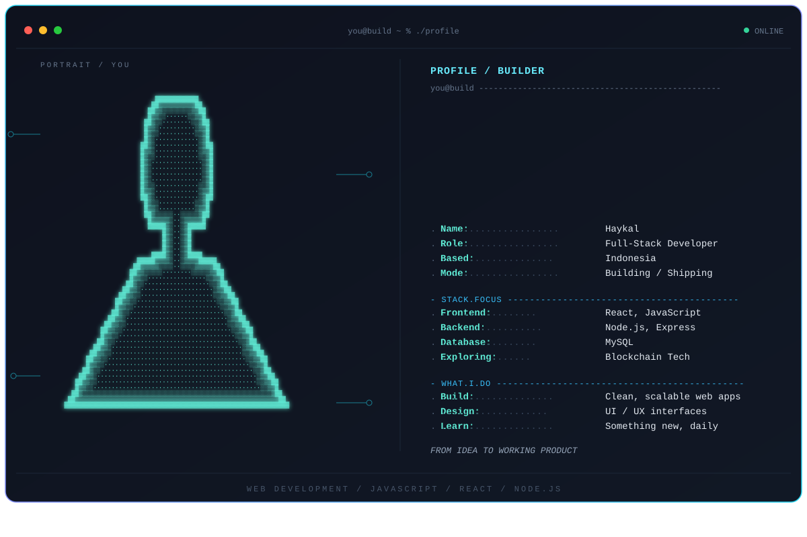

---

## 🌐 Connect With Me

<!-- Ganti link/username sesuai akun kamu -->

---

## 💻 Tech Stack

---

## 📊 GitHub Stats

---

## 🏆 GitHub Trophies

---

## 🔝 Top Contributed Repo

<!-- Ganti "yourusername/your-repo" dengan repo andalan kamu -->

